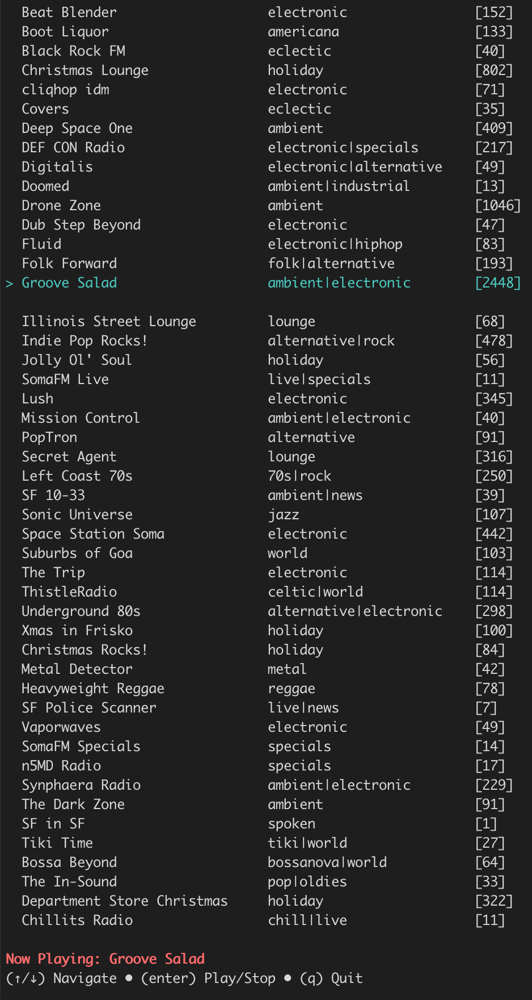

# SomaFM Terminal Player

A terminal-based SomaFM radio player built with [Bubble Tea](https://github.com/charmbracelet/bubbletea).



## Features

- Browse SomaFM channels with real-time listener counts
- Play/stop streams with a enter key
- Navigate channels with up and down arrow keys
- Simple and intuitive TUI interface
- Keyboard-driven navigation

## Installation

First of all, go and build the program in the `somafm-cli-go` directory.

```bash
go build
```

Then, you can run the program.

```bash
./somafm-cli-go
```


## Dependencies

- Go 1.16 or later
- MPV player installed on your system

### Installing MPV

#### macOS
```bash
# Using Homebrew
brew install mpv

# Using MacPorts
sudo port install mpv
```

#### Linux
```bash
sudo apt-get install mpv
```

#### Windows
```bash
choco install mpv
```

#### Arch Linux
```bash
sudo pacman -S mpv
```

#### Fedora
```bash
sudo dnf install mpv
```

#### OpenSUSE
```bash
sudo zypper install mpv
```

#### Gentoo
```bash
sudo emerge media-video/mpv
```

#### FreeBSD
```bash
pkg install mpv
```

#### Other
Refer to the [MPV installation guide](https://mpv.io/installation/) for other operating systems.
